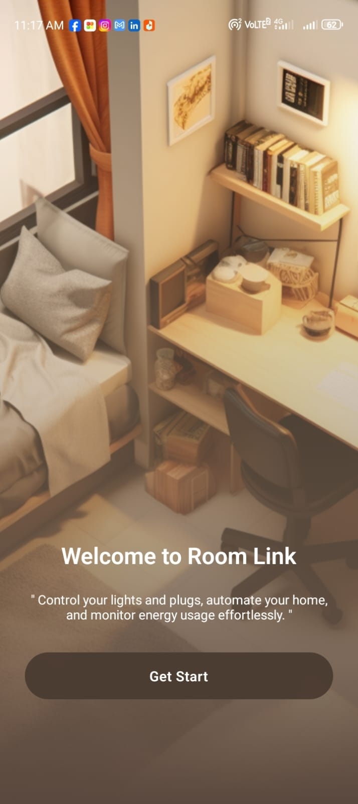
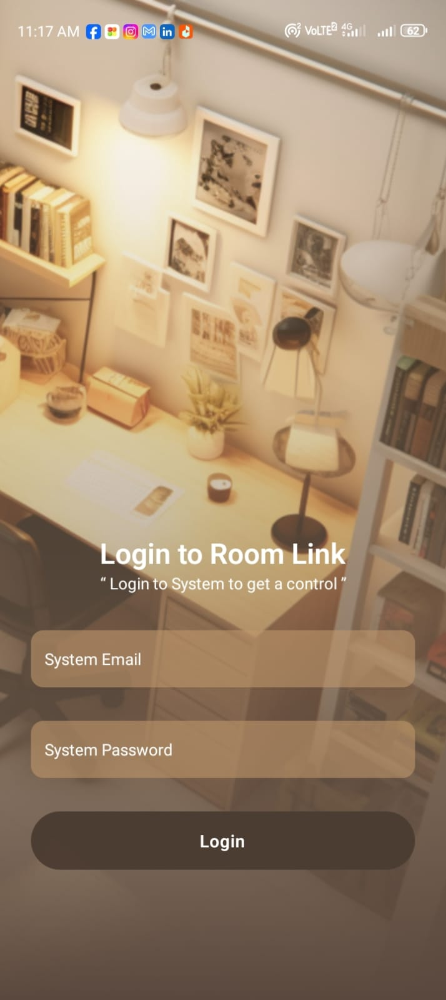
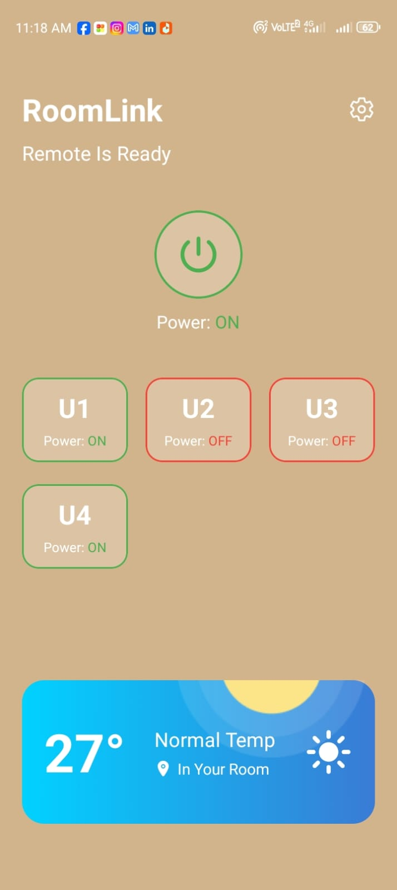

# 📱 RoomLink — Smart Room Controller App

RoomLink is a mobile-first IoT app built with **React Native (Expo)** and **ESP32** that allows users to remotely control room relays (lights/plugs), toggle main power, and monitor room temperature via a friendly UI. It uses a **Firebase Realtime Database** as a cloud bridge to sync data between the mobile app and the hardware.

## 📸 Screenshots





## 🚀 Features

### 📱 Mobile App (React Native)
- 📶 Connect to Firebase Realtime Database
- 🔌 Toggle individual unit (relay) power on/off  
- ⚡ Toggle main power to control all units at once
- 🌡️ Display room temperature (demo/static for now)
- 🔒 Navigation system with a start page, login page, and home dashboard
- 🎨 Modern, responsive UI

### 📟 ESP32 Controller (Arduino)
- 📡 Connects to Wi-Fi
- 🔥 Reads real-time JSON values from Firebase
- 📥 Parses JSON response to control 4 relays (Active LOW)
- 📊 Serial monitor feedback for debugging
- 🔴🔵🟢 LED indicators for Wi-Fi status, Firebase status, and errors

## 🛠️ Built With

- **React Native + Expo**
- **Firebase Realtime Database**
- **ESP32 with ArduinoJson and HTTPClient**
- **React Navigation**
- **Expo Linear Gradient & Vector Icons**

## ⚙️ Arduino Controller Setup

### 📥 Required Libraries:
- **WiFi.h**
- **HTTPClient.h**
- **ArduinoJson.h**

### 📡 Wi-Fi & Firebase Setup:
- Replace the following with your own credentials:
```cpp
const char* ssid = "your-ssid";
const char* password = "your-password";
const char* firebaseURL = "https://your-project-id.firebaseio.com/relayArry.json";
```

### 🖥️ Uploading:
1. Connect ESP32 to your PC.
2. Install dependencies via Arduino IDE (Tools → Manage Libraries…).
3. Select correct board and port.
4. Upload `RoomLink_Controller.ino`.

### 🔌 Relay Wiring:
- Relay1 → GPIO15  
- Relay2 → GPIO2  
- Relay3 → GPIO4  
- Relay4 → GPIO5  
- Status LEDs:  
  - Red → GPIO19  
  - Blue → GPIO21  
  - Green → GPIO23  

### 🔄 JSON Data Format (from Firebase):
```json
{
  "relay1": "ON",
  "relay2": "OFF",
  "relay3": "ON",
  "relay4": "OFF"
}
```

## 📝 Notes

- **Relays are Active LOW**: `LOW` = ON, `HIGH` = OFF
- LED indicators show Wi-Fi, Firebase connection, and response status.
- Mobile app controls Firebase which syncs to ESP32 every 2 seconds.

## 📄 License

Open-source. Free to use and modify.

## 👨‍💻 Author

- **Ashen** — [https://amliyanage.me/](https://amliyanage.me/)
